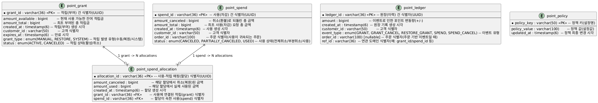

# 무료 포인트 시스템

## 1. 프로젝트 개요

주문 연동형 무료 포인트 시스템입니다. 적립/적립취소/사용/사용취소 4가지 핵심 기능을 제공하며,
1원 단위로 어떤 적립에서 어떤 주문으로 사용되었는지 추적할 수 있습니다.

### 기술 스택

| 항목        | 버전/내용                       |
|-----------|-----------------------------|
| Language  | Java 21                     |
| Framework | Spring Boot 3.5             |
| Database  | H2 (in-memory, MySQL 호환 모드) |
| ORM       | Spring Data JPA + Hibernate |
| Build     | Gradle                      |
| Test      | JUnit 5 + AssertJ           |

---

## 2. 빌드 및 실행

### 사전 요구사항

- Java 21 이상

### 빌드

```bash
./gradlew build
```

### 실행

```bash
./gradlew bootRun
```

서버가 `http://localhost:8080`에서 시작됩니다.

### H2 콘솔

서버 실행 후 `http://localhost:8080/h2-console` 에서 DB를 직접 조회할 수 있습니다.

| 항목        | 값                    |
|-----------|----------------------|
| JDBC URL  | `jdbc:h2:mem:points` |
| User Name | `sa`                 |
| Password  | (비워두기)               |

---

## 3. API 명세

서버 실행 후 Swagger UI에서 전체 API 명세를 확인하고 직접 테스트할 수 있습니다.

```
http://localhost:8080/swagger-ui/index.html
```

| 기능     | Method | Endpoint                                    |
|--------|--------|---------------------------------------------|
| 포인트 적립 | POST   | `/v1/points/grants`                         |
| 적립 취소  | POST   | `/v1/points/grants/{grantId}/cancellations` |
| 포인트 사용 | POST   | `/v1/points/spends`                         |
| 사용 취소  | POST   | `/v1/points/spends/{spendId}/cancellations` |

---

## 4. 핵심 로직과 설계 의도

### 4.1 사용 우선순위

포인트 사용 시 다음 순서로 차감합니다.

1. **수기 지급(MANUAL) 우선** : 관리자가 직접 지급한 포인트를 먼저 사용
2. **만료 임박순** : 만료일이 가까운 적립부터 차감
3. **적립일순** : 만료일이 동일한 경우 먼저 적립된 것부터 차감

이 순서는 `PointGrantRepository.findUsableGrantsWithLock()`의 ORDER BY로 보장됩니다.

```sql
ORDER BY CASE WHEN grant_type = 'MANUAL' THEN 0 ELSE 1
END
,
         expires_at ASC,
         created_at ASC
```

### 4.2 사용 추적 (1원 단위)

`PointSpendAllocation` 테이블이 적립(Grant)과 사용(Spend) 사이의 매핑을 기록합니다.
하나의 사용이 여러 적립에 걸쳐 차감되는 경우, 각각의 적립에서 얼마를 사용했는지 개별 추적합니다.

```
Spend 1200원
  ├─ Allocation: Grant A에서 1000원
  └─ Allocation: Grant B에서 200원
```

### 4.3 사용취소 시 만료 처리

사용취소 시점에 원래 적립이 이미 만료된 경우, 해당 금액만큼 `RESTORE` 타입으로 신규 적립합니다.

```
사용취소 1100원 요청
  ├─ Grant A (만료됨): 1000원 → 신규 RESTORE 적립 생성
  └─ Grant B (유효함): 100원 → 원래 적립에 복원
```

### 4.4 정책의 외부화

적립 한도, 보유 한도, 기본 만료일은 `point_policy` 테이블에서 관리합니다.
재배포 없이 운영 중 DB 값 변경으로 정책을 조정할 수 있습니다.

| 정책 키                      | 기본값       | 설명                    |
|---------------------------|-----------|-----------------------|
| MAX_GRANT_PER_TRANSACTION | 100,000   | 1회 최대 적립 금액           |
| MAX_BALANCE_PER_USER      | 1,000,000 | 고객당 최대 보유 잔액          |
| DEFAULT_EXPIRE_DAYS       | 365       | 만료일 미지정 시 기본 유효기간 (일) |

### 4.5 원장(Ledger) 패턴

초기에는 Ledger(원장) 단일 테이블로 모든 포인트 흐름을 관리하는 방식을 고려했습니다.
그러나 과제 요구사항을 분석하면서 이 구조만으로는 한계가 있다고 판단했습니다.

- 각 적립건별로 **잔액(amountAvailable)을 개별 관리**해야 만료/취소를 건별로 처리할 수 있음
- 사용 시 **어떤 적립에서 얼마를 차감했는지** 1원 단위로 추적해야 사용취소 시 정확한 복원이 가능함
- MANUAL 우선, 만료 임박순 같은 **차감 우선순위**는 적립건이 독립 엔티티여야 쿼리로 제어할 수 있음

이러한 이유로 적립(Grant), 사용(Spend), 배분(Allocation)을 각각 독립 엔티티로 분리하고,
Ledger는 **감사/정합성 검증용 이벤트 로그** 역할에 집중하는 구조로 변경했습니다.
결과적으로 Grant/Spend가 현재 상태(snapshot)를, Ledger가 변경 이력(event log)을 담당합니다.

| 이벤트 타입        | 금액 부호 | 설명             |
|---------------|-------|----------------|
| GRANT         | +     | 적립             |
| GRANT_CANCEL  | -     | 적립 취소          |
| SPEND         | -     | 사용             |
| SPEND_CANCEL  | +     | 사용 취소          |
| RESTORE_GRANT | +     | 만료 적립 복원 신규 적립 |

### 4.6 동시성 제어

포인트 사용/취소 시 비관적 락(Pessimistic Write Lock)을 사용합니다.

- 포인트 사용: 대상 적립건들에 `SELECT ... FOR UPDATE`
- 적립 취소: 대상 적립건에 `SELECT ... FOR UPDATE`
- 사용 취소: 대상 사용건에 `SELECT ... FOR UPDATE`

포인트 차감은 충돌 빈도가 높을 수 있어 Optimistic Lock보다 Pessimistic Lock이 재시도 비용 측면에서 유리하다고 판단했습니다.

---

## 5. ERD



---

## 6. 아키텍처 구성 시 고민한 점

### 레이어 구조

```
Controller (API 진입점, 입력 검증)
    ↓
Service (비즈니스 로직, 트랜잭션 경계)
    ↓
Domain Entity (상태 변경, 도메인 규칙)
    ↓
Repository (데이터 접근, Lock 쿼리)
```

도메인 엔티티에 비즈니스 로직(`debit`, `credit`, `cancel`, `applyCancel`)을 배치하여
서비스 레이어가 흐름 조율에 집중하도록 했습니다.

### 일급 컬렉션 (UsableGrants)

사용 가능한 적립 목록을 `UsableGrants`로 감싸서 잔액 검증(`validateSufficientBalance`)과
차감 로직(`deduct`)을 캡슐화했습니다. 이를 통해 서비스에서의 절차적 코드를 줄이고,
차감 규칙 변경 시 영향 범위를 한 곳으로 제한했습니다.

### 에러 코드 체계

`ErrorCode` enum으로 비즈니스 예외를 체계적으로 관리합니다.
`GlobalExceptionHandler`에서 `BusinessException`을 잡아 일관된 에러 응답 형식으로 변환합니다.

```json
{
  "timestamp": "2025-01-01T00:00:00Z",
  "code": "SPEND_001",
  "message": "포인트 잔액이 부족합니다.",
  "path": "/v1/points/spends"
}
```

---

## 7. 테스트

### 실행

```bash
./gradlew test
```

## 8. 에러 코드

| 코드         | HTTP | 설명                           |
|------------|------|------------------------------|
| COMMON_001 | 400  | 입력값이 유효하지 않습니다               |
| GRANT_001  | 400  | 적립 금액은 1원 이상, 정책 상한 이하여야 합니다 |
| GRANT_002  | 400  | 만료일은 1일 이상, 5년 미만이어야 합니다     |
| GRANT_003  | 400  | 고객 보유 한도를 초과합니다              |
| GRANT_004  | 404  | 적립 내역을 찾을 수 없습니다             |
| GRANT_005  | 409  | 이미 사용된 적립은 취소할 수 없습니다        |
| GRANT_006  | 409  | 이미 취소된 적립입니다                 |
| SPEND_001  | 400  | 포인트 잔액이 부족합니다                |
| SPEND_002  | 409  | 이미 처리된 주문입니다                 |
| SPEND_003  | 404  | 사용 내역을 찾을 수 없습니다             |
| SPEND_004  | 400  | 취소 금액이 유효하지 않습니다             |
| SPEND_005  | 409  | 이미 전액 취소된 사용입니다              |

---

## 9. 향후 개선 계획

### 성능

- **정책 캐시** : `PointPolicyService`에 `@Cacheable` 적용. 현재 매 요청마다 DB를 조회하고 있어, TTL 기반 캐시와 정책 변경 시 `@CacheEvict`를 적용할 계획입니다.
- **인덱스** : `(customer_id, status, expires_at)` 복합 인덱스 추가. 실제 RDBMS 전환 시 사용 가능 적립 조회 성능에 직접적인 영향이 있습니다.

### 기능

- **잔액 조회 API** : `GET /v1/points/balance?customerId=xxx`로 현재 사용 가능 잔액을 조회하는 기능이 필요합니다.
- **거래 내역 조회 API** : `GET /v1/points/history?customerId=xxx`로 Ledger 기반 포인트 변동 이력을 제공할 수 있습니다.

### 설계

- **일급 컬렉션 확장** : 사용취소 시 Allocation 처리 로직을 `SpendAllocations` 일급 컬렉션으로 추출하여, 현재 Service에 있는 절차적 코드를 도메인 객체로 캡슐화할 수 있습니다.

### 운영

- **대규모 트래픽 대응** : 비관적 락의 처리량 한계에 대비하여 Redis 분산 락 또는 고객별 큐잉 직렬화 방식을 검토할 수 있습니다.
